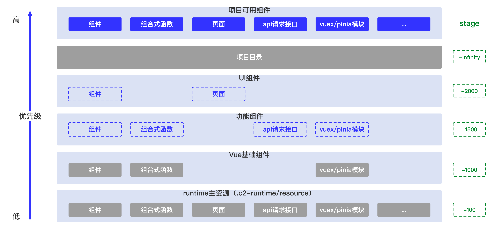

# 自动导入研发模式

::: tip 提示
自动帮你导入组件、api服务、可组合函数、Vue API等等内容以便您在项目中无需关心显式引用而直接使用这些 API；与传统的全局注册相反，自动导入研发模式保留了 Typescript 和 IDE 的代码提示与补全，并且它是真正的按需加载。
:::

## 什么是自动导入研发模式
### 传统研发模式

在传统的研发模式下，通常情况我们需要在项目中会书写大量的引用代码，以如下目录结构为例：

```
|- components
|--- a
|----- b.vue
|----- c.vue
|----- index.js
```

我们会产生如下的一类引入：

```js
// components/a/index.js
export { default as B } from './b.vue'
export { default as C } from './c.vue'

// xxx.js
import { B } from '@/components/a'
// or
import B from '@/components/a/b.vue'
```

### 自动导入研发模式

当你使用自动导入研发模式时，您无需再维护 `components/a/index.js` 以及相应的 `import` 语句：

<div class="composition-api">

```vue
<template>
  <!-- @/components/a/b.vue -->
  <a-b :data="data" />
</template>

<script setup>
// import { ref } from 'vue'
const data = ref('')
</script>
```

</div>

<div class="options-api">

```vue
<template>
  <!-- @/components/a/b.vue -->
  <a-b :data="data" />
</template>

<script>
export default defineComponent({
  components: {
    AB
  },
  data() {
    return {
      data: ''
    }
  }
})
</script>
```

</div>

<!-- <div class="react-api">

</div> -->

**vona-js 将会自动帮你将 `@/components/a/b.vue` 和 `ref` 进行引入。**

## 为什么我们需要自动导入研发模式

- 当项目复杂度增加时，`import` 语句和二次导出的维护工作将变得非常复杂。
- 传统的二次导出做法在 `vite` 开发模式下，将会存在请求数量过多的性能问题。
- `vona-js` 提供的核心资源沉淀方案主要依赖自动导入机制为项目服务，如下图所示：



我们在不同的层级提供了一系列优先级不同的项目可用资源（组件、页面、组合式函数等内容），最终通过 `vona-js` 合并后交由开发使用，我们 `import { xx } from 'vona-js'` 的内容可能来自上图中的任意一个层级，同时我们的业务组件也可以 通过 **UI组件** 和 **功能组件** 的形式来进行沉淀以完成跨项目的复用。

## vona-js 的自动引入研发模式

自动引入研发模式主要依赖于文件的加载和解析规则，下面将介绍各类前端资源的解析模式。

### 框架与类库的自动导入

以 vue 开发场景为例，Vue 公开的 Reactivity API 以及 vona-js 公开的辅助 API等内容均被自动导入。

```vue
<script setup>
// ref、useStore are auto-imported
const data = ref('')
const store = useStore()
</script>
```

### 组件的自动导入

vona-js 直接扫描 `src/components/` 下的`{js,ts,jsx,tsx,vue}`组件，并生成自动导入组件。

- 扫描规则

::: tip 提示
vona-js 将以文件及其目录作为组件命名，其中以 `.` 或者 `_` 开头的文件与文件夹将被忽略。
:::

```
|- components
|--- test
|----- _components // 忽略
|----- _utils // 忽略
|----- b.vue // TestB
|----- c.vue // TestC
|----- index.vue // Test
```

- 使用方式

::: tip 提示
当附带 `lazy` 前缀时，该组件将被解析为异步组件。
:::

```vue
<template>
  <!-- 同步加载：@/components/test/b.vue -->
  <test-b :data="data" />
  <!-- 懒加载：@/components/test/c.vue -->
  <lazy-test-c />
</template>
```

### 组合式函数的自动导入

vona-js 直接扫描 `src/composables/` 下的`{js,ts}`文件，并生成自动导入组合式函数。

- 扫描规则

::: tip 提示
vona-js 将仅解析 第一级文件与第二级的 `index` 文件作为组合式函数的内容扫描来源，其中仅扫描 `use` 或者 `get` 开头的命名导出函数。
:::

```
|- composables
|--- _utils // 忽略
|--- use-xxx.js
|--- use-yyy
|----- index.js

<!-- use-xxx.js -->
export const useXxx1 = ... // 将被扫描到
export const useXxx2 = ... // 将被扫描到
export * from './xxx' // 将被忽略

<!-- use-yyy/index.js -->
export const useYyy1 = ... // 将被扫描到
export const useYyy2 = ... // 将被扫描到
```

- 使用方式

```vue
<script setup>
const some = useXxx1()
const some1 = useYyy1()
</script>
```

### 布局的自动导入

vona-js 直接扫描 `src/layouts/` 下的`{jsx,tsx,vue}`文件，并生成自动导入组合式函数。

- 扫描规则

::: tip 提示
vona-js 将仅解析 第一级文件与第二级的 `index` 文件作为组合式函数的内容扫描来源。
:::

```
|- layouts
|--- _utils // 忽略
|--- default.vue // 将被扫描到
|--- other
|----- index.vue // 将被扫描到
|----- test.vue // 将被忽略
```

- 使用方式

```vue
<script setup>
const layout = useLayoutContext()
// 切换应用顶级布局到 other
layout.setLayout('Other')
</script>
```

### api服务的自动导入

vona-js 直接扫描 `src/api/` 下的`{js,ts}`文件，并生成自动导入 `api` 服务。

- 扫描规则

::: tip 提示
vona-js 将所有非 `.` 或者 `_` 开头的文件与文件夹作为`api` 服务的内容扫描来源，其中仅扫描 `Service` 结尾的命名导出`api` 服务函数。
:::

```
|- api
|--- _utils // 忽略
|--- org.js
|--- user
|----- index.js

<!-- org.js -->
export const getOrgService = ... // 将被扫描到
export * from './xxx' // 将被忽略

<!-- user/index.js -->
export const getUserService = ... // 将被扫描到
```

- 使用方式

```vue
<script setup>
const { data } = getOrgService()
</script>
```

### 图标的自动导入

vona-js 直接扫描 `src/icons/` 下的`svg`文件，并生成自动导入的图标组件。

::: tip 提示
vona-js 将所有非 `.` 或者 `_` 开头的文件与文件夹作为`svg`图标的扫描来源。
:::

```
|- icons
|--- _utils // 忽略
|--- logo.svg
```

- 自动导入使用方式

```vue
<template>
  <IconBdsLogo />
</tempalte>
```

- 显式导入使用方式

```
<template>
  <IconBdsLogo />
</tempalte>
<script setup>
import IconBdsLogo from '~icons/bds/logo'
</script>
```

## 显式的使用自动引入

vona-js 同时也提供了类传统模式的显式引入，同保留自动导入准确、按需特性的使用方式。

```vue
<template>
  <!-- @/components/test/b.vue -->
  <TestB :data="data" />
</template>

<script setup>
import { ref, TestB, useStore, getOrgService } from 'vona-js'
const data = ref('')
const store = useStore()
const some = getOrgService()
</script>
```
